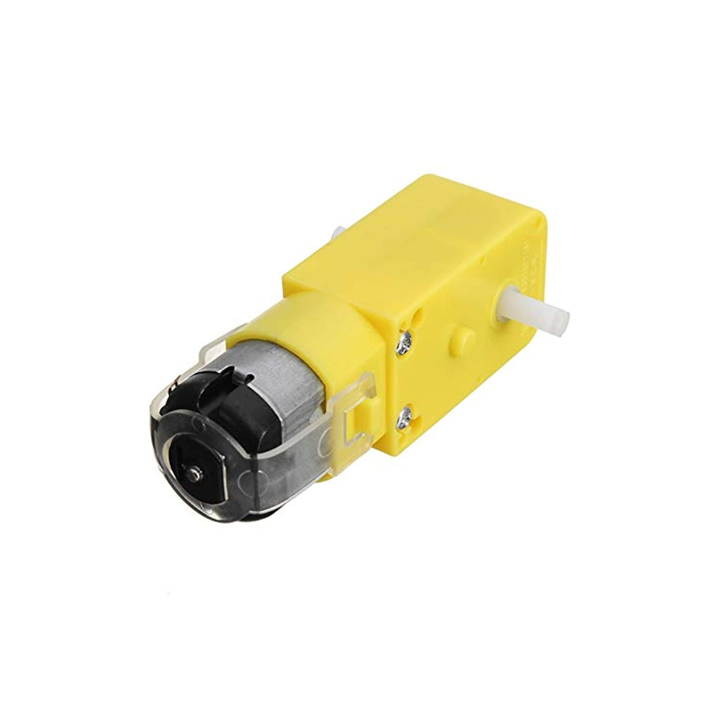
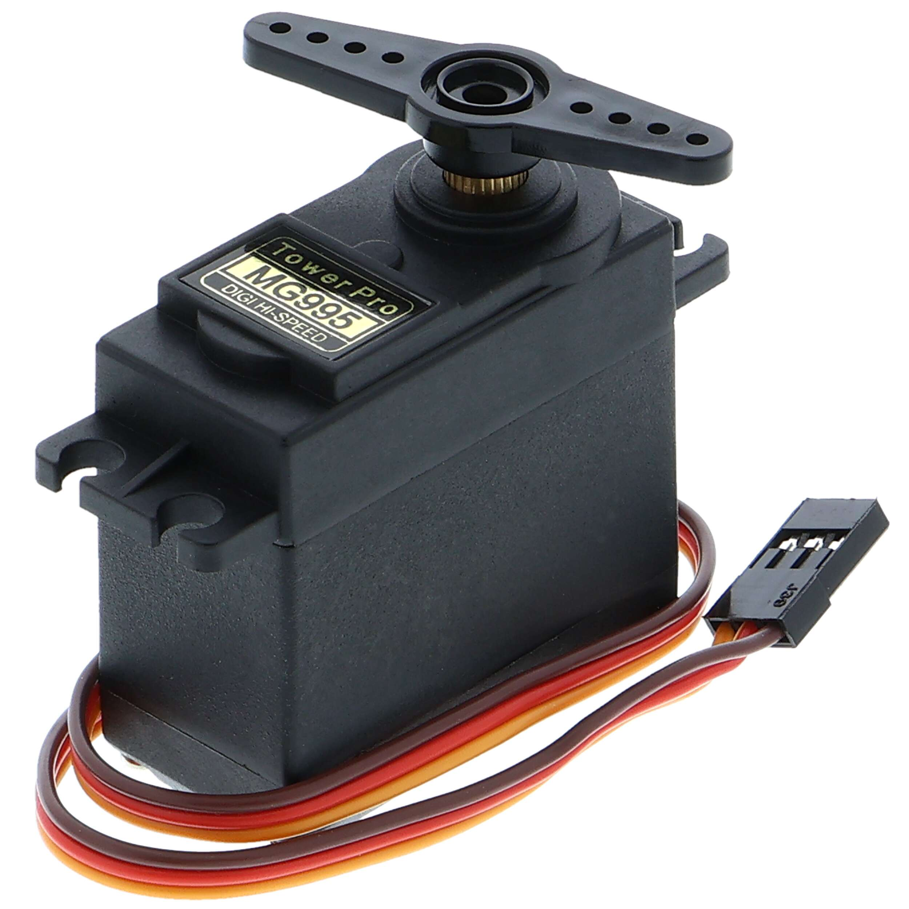
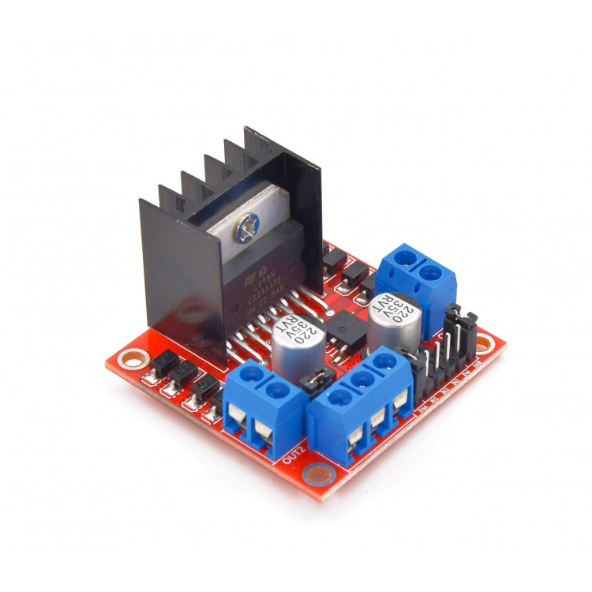
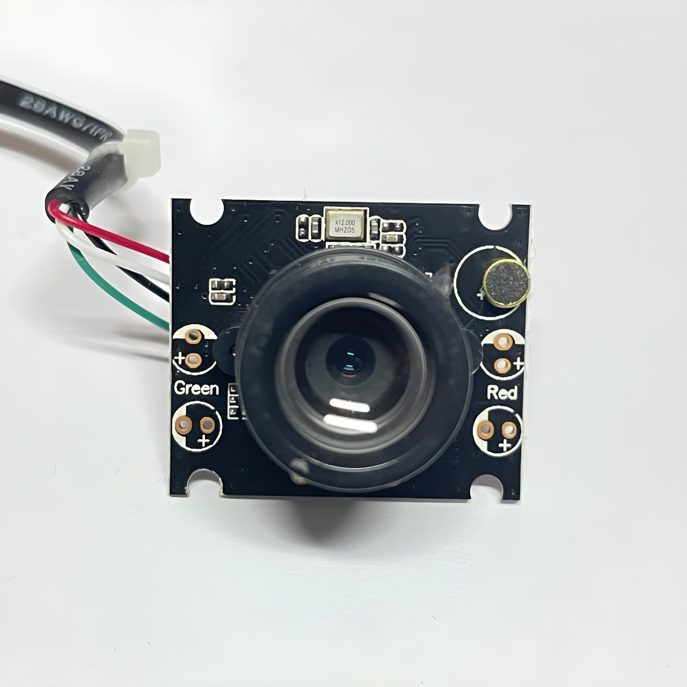
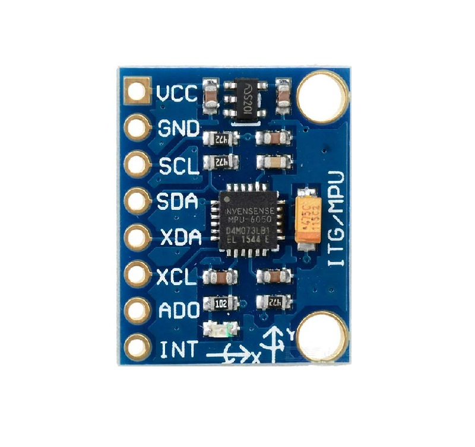

# SANDSTORM_FE_WRO
Official SANDSTORM's future engineers repo for WRO, Here is our GitHub Documentation, You can navigate through it using the names on the Folders, "Code" has the main program and the testing program. "Schemes" has journals, , CAD files, BOM, Diagrams, and other documents. "Videos" got YouTube links for the videos of the trials. "Images" got photos of the prototype, photos of team members, logo, and some photos of the journey. 

# Hello, we are Team SANDSTORM!

We’re excited to introduce our robot for this year’s competition. You can check out a video of the robot in action here: [YouTube Video Link].

Additionally, all of our source code and design documentation can be found on our GitHub repository: https://github.com/abdo20050/SANDSTORM_FE_WRO/tree/main.

# Overview of Our Robot Design:
Our robot is powered by a robust 6 lithium battery setup, which provides stable power to all its components, including the motors and the processing unit. The robot is built on a custom-designed, 3D-printed chassis, optimized for both durability and lightweight maneuverability.

At the heart of our system is the Raspberry Pi 5, which controls everything from motor movements to the real-time video processing needed for navigation and obstacle avoidance. The webcam, directly connected to the Raspberry Pi, captures live footage, enabling the robot to make intelligent decisions on the field.

# Motor and Steering Control:
Drive System: The robot uses a T-shaped 6V DC motor to power the rear wheels, which ensures steady forward and backward motion.
Steering: The front wheels are controlled by an MG995 servo motor, which handles all steering actions. This setup allows for precise control of both soft and hard turns, depending on the situation.
The rear-wheel drive is controlled by an L298N H-Bridge, which acts as the intermediary between the motor and the Raspberry Pi. This allows us to efficiently manage both the speed and direction of the motor.

# Vision and Obstacle Detection:
For object detection, lane following, and trafic signal identification, the robot relies on a webcam mounted on the chassis. This camera feeds real-time video to the Raspberry Pi for processing, allowing it to sense obstacles and avoid collisions by adjusting its direction accordingly.

# Tracking Progress:
To keep track of its movement and ensure accurate lap completion, we’ve incorporated an MPU6050 IMU (Inertial Measurement Unit). This sensor measures the robot's orientation and movement, ensuring that it completes the required laps and maintains its balance while making turns.

# User Feedback and Monitoring:
We were testing the robot in the challenge by having it do practice laps and test drives to insure that balance, accuracy and precision are on point, This allows us to monitor the robot’s performance during the challenge and make adjustments if necessary.

# Key Components at a Glance:

`Raspberry Pi 5 – The main controller for processing inputs and controlling the motors and camera.`

`6V T-Shaped DC Motor – Drives the rear wheels, enabling smooth forward and backward motion.`

`MG995 Servo Motor – Controls the front wheels for steering.`

`L298N H-Bridge – Motor driver that controls the speed and direction of the DC motor.`

`Webcam – Captures live video for real-time object detection and lane following.`

`MPU6050 IMU – Tracks orientation and movement to ensure accurate lap counting (we removed it temporarily).`

Custom 3D-Printed Chassis – Lightweight and durable, designed to hold all components securely.

Power Supply – Powered by 6 lithium batteries, ensuring reliable energy for all components.

This is the robot we’ve designed and built to tackle this year's challenge! For more details on how it works and how we approached the problem, feel free to explore the source code and documentation on our GitHub: https://github.com/abdo20050/SANDSTORM_FE_WRO/tree/main, there is also a document that has more information: https://docs.google.com/document/d/1cCJuQa-ENeIftLrWq0BU486fTGV7BMiAK_tZXONVTxw/edit?usp=sharing, please request access or ask one of the team member to show you.

Thank you for following our journey! Let us know if you have any questions or feedback.

