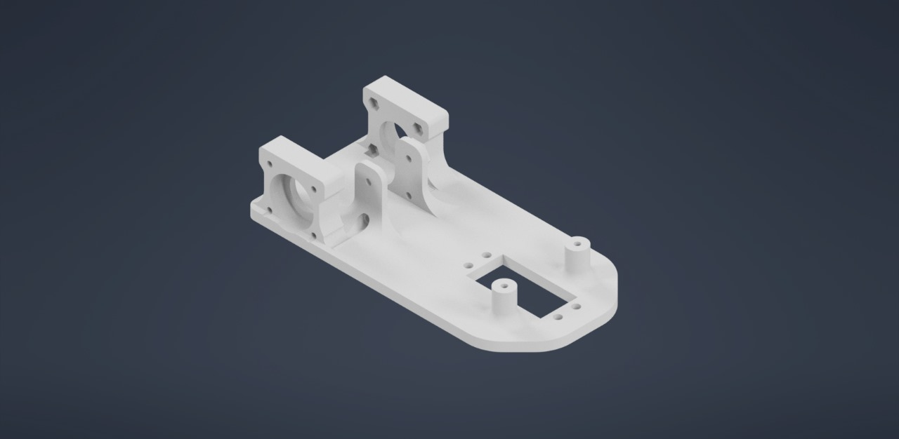

# SANDSTORM_FE_WRO

Official SANDSTORM's future engineers repo for WRO. Here is our GitHub Documentation. You can navigate through it using the folder names:
- **Code** contains the main program and the testing program.
- **Schemes** includes journals, photos of CAD files, BOM, diagrams, and other documents.
- **Videos** has YouTube links for the trials.
- **ImagesV** contains photos of the prototypes, and vehicle parts
- **ImagesT** contains photos of the team members, logo, and our journey

# Hello, we are Team SANDSTORM!

We’re excited to introduce our robot for this year’s competition. You can check out a video of the robot in action here: [YouTube Video Link].

Additionally, all of our source code and design documentation can be found on our [GitHub repository](https://github.com/abdo20050/SANDSTORM_FE_WRO/tree/main.)

# Strategy:

Our robot is equipped with a webcam that handles multiple tasks, making the design more cost-efficient by reducing the need for additional sensors. The webcam detects the blue and orange lines to track the number of laps completed and determine whether the robot is moving clockwise or counterclockwise. It also identifies black walls to avoid collisions and reverse if necessary.

For the obstacle challenge, the webcam continues its primary functions and additionally detects red and green traffic signals to decide the direction the robot should take. The webcam is also used to adjust the calibration to accommodate different lighting conditions. Overall, the robot relies entirely on the webcam for all tasks in the challenge.

# Overview of Our Robot Design:

Our robot is powered by a robust **6 lithium battery** setup, providing stable power to all components, including the motors and the processing unit. The robot is built on a custom-designed, **3D-printed chassis**, optimized for durability and lightweight maneuverability.

At the heart of our system is the **Raspberry Pi 5**, which controls motor movements and processes real-time video for navigation and obstacle avoidance. The **webcam**, connected directly to the Raspberry Pi, captures live footage, enabling the robot to make intelligent decisions on the field.

# Motor and Steering Control:

- **Drive System**: The robot uses a **T-shaped 6V DC motor** to power the rear wheels, ensuring steady forward and backward motion.
- **Steering**: The front wheels are controlled by an **MG995 servo motor**, allowing precise control for both soft and hard turns, depending on the situation.

The rear-wheel drive is managed by an **L298N H-Bridge**, which mediates between the motor and the Raspberry Pi, efficiently controlling both speed and direction.

# Vision and Obstacle Detection:

For object detection, lane following, and traffic signal identification, the robot relies on a **webcam** mounted on the chassis. This camera sends real-time video to the Raspberry Pi for processing, allowing the robot to detect obstacles and adjust its direction accordingly.

# Tracking Progress:

To track movement and ensure accurate lap completion, we’ve incorporated an **MPU6050 IMU**. This sensor measures the robot’s orientation and movement, ensuring the robot completes the required laps and maintains balance during turns.

# User Feedback and Monitoring:

We tested the robot through practice laps and test drives to ensure that balance, accuracy, and precision are on point. This allowed us to monitor the robot’s performance during the challenge and make adjustments as necessary.

# Key Components at a Glance:

`Raspberry Pi 5 – The main controller for processing inputs and controlling the motors and camera.`

`6V T-Shaped DC Motor – Drives the rear wheels, enabling smooth forward and backward motion.`

`MG995 Servo Motor – Controls the front wheels for steering.`

`L298N H-Bridge – Motor driver that controls the speed and direction of the DC motor.`

`Webcam – Captures live video for real-time object detection and lane following.`

`MPU6050 IMU – Tracks orientation and movement to ensure accurate lap counting (we removed it temporarily).`

`Custom 3D-Printed Chassis – Lightweight and durable, designed to securely hold all components.`

`Power Supply – Powered by 6 lithium batteries, ensuring reliable energy for all components.`

---

This is the robot we’ve designed and built to tackle this year's challenge! For more details on how it works and how we approached the problem, feel free to explore the source code and documentation on our [GitHub](https://github.com/abdo20050/SANDSTORM_FE_WRO/tree/main.)

Additionally, here’s a document with more information: [Google Doc Link](https://docs.google.com/document/d/1cCJuQa-ENeIftLrWq0BU486fTGV7BMiAK_tZXONVTxw/edit?usp=sharing) (please request access or ask a team member for details).

Thank you for following our journey! Let us know if you have any questions or feedback.
